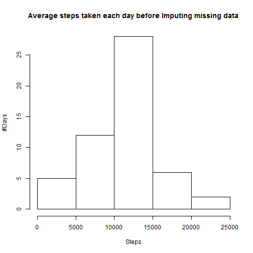
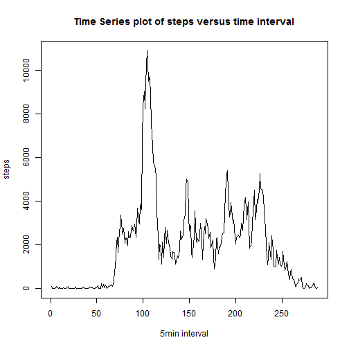
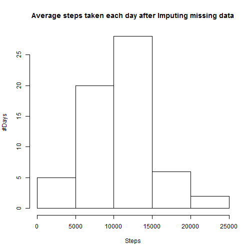
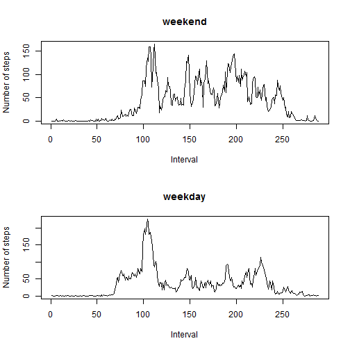

## Loading and preprocessing the data


```r
data <- read.csv("activity.csv")
data$date <- as.Date(paste(data$date))
```

## Histogram of Average steps taken each day before imputing

The following code chunk creates a histogram of the total number of steps taken per day
and calculates mean and median of that data.


```r
x <- tapply(data$steps, data$date, sum)
hist(x, main=paste("Average steps taken each day before Imputing missing data"), xlab="Steps",ylab="#Days")
```

 

```r
y <- as.numeric(paste(x))
```

```
## Warning: NAs introduced by coercion
```

```r
isNA <- is.na(y)
y <- y[!isNA]
mean(y)
```

```
## [1] 10766.19
```

```r
median(y)
```

```
## [1] 10765
```

As you can see above:

1. Mean: 10766.19
2. Median: 10765

## 5 minute interval time series plot


```r
compcases <- complete.cases(data)
datacomplete <- data[compcases,]

timeseries <- tapply(datacomplete$steps, datacomplete$interval, sum)
plot(timeseries, type = "l", xlab="5min interval", ylab="steps", main="Time Series plot of steps versus time interval")
```

 

```r
order <- order(timeseries)
timeseries[order[length(order)]]
```

```
##   835 
## 10927
```

As you can see, there is a massive peak relatively early in the day.
The five minute interval with the maximum number of steps is interval 835, with 10927 steps.

## Imputing missing Values

I choose to Impute missing step data by averaging over the corresponding 5 minute interval step data of all
the other days.


```r
isNA <- is.na(data$steps)
sum(isNA)
```

```
## [1] 2304
```

```r
totals <- tapply(datacomplete$steps, datacomplete$interval, sum)
days <- unique(data$date)
days <- length(days)
averages <- totals/days

data2 <- data
data2$averages <- averages
data2$steps[!compcases] <- data2$averages
```

```
## Warning in data2$steps[!compcases] <- data2$averages: number of items to
## replace is not a multiple of replacement length
```

```r
head(data)
```

```
##   steps       date interval
## 1    NA 2012-10-01        0
## 2    NA 2012-10-01        5
## 3    NA 2012-10-01       10
## 4    NA 2012-10-01       15
## 5    NA 2012-10-01       20
## 6    NA 2012-10-01       25
```

```r
head(data2)
```

```
##        steps       date interval   averages
## 1 1.49180328 2012-10-01        0 1.49180328
## 2 0.29508197 2012-10-01        5 0.29508197
## 3 0.11475410 2012-10-01       10 0.11475410
## 4 0.13114754 2012-10-01       15 0.13114754
## 5 0.06557377 2012-10-01       20 0.06557377
## 6 1.81967213 2012-10-01       25 1.81967213
```

Here, head(data) and head(data2) have been printed to showcase how averages populate previously "NA"'d values.

## Histogram of Average steps taken each day after imputing


```r
x <- tapply(data2$steps, data2$date, sum)
hist(x, main=paste("Average steps taken each day after Imputing missing data"), xlab="Steps",ylab="#Days")
```

 

```r
y <- as.numeric(paste(x))
isNA <- is.na(y)
y <- y[!isNA]
mean(y)
```

```
## [1] 10581.01
```

```r
median(y)
```

```
## [1] 10395
```

1. Mean: 10581.01
2. Median: 10395

There are now a couple more days in the 5000-10000 steps range.

## Weekend/Weekday split


```r
data2$weekdays <- weekdays(data2$date)
data2$weekend <- FALSE
data2$weekend <- data2$weekday %in% c("Saturday","Sunday")
head(data2)
```

```
##        steps       date interval   averages weekdays weekend
## 1 1.49180328 2012-10-01        0 1.49180328   Monday   FALSE
## 2 0.29508197 2012-10-01        5 0.29508197   Monday   FALSE
## 3 0.11475410 2012-10-01       10 0.11475410   Monday   FALSE
## 4 0.13114754 2012-10-01       15 0.13114754   Monday   FALSE
## 5 0.06557377 2012-10-01       20 0.06557377   Monday   FALSE
## 6 1.81967213 2012-10-01       25 1.81967213   Monday   FALSE
```


```r
par(mfrow=c(2,1))
weekdays <- subset(data2, data2$weekend==FALSE)
weekends <- subset(data2, data2$weekend==TRUE)
weekday_averages <- tapply(weekdays$steps, weekdays$interval, sum)
weekday_averages <- weekday_averages/length(unique(weekdays$date))

weekend_averages <- tapply(weekends$steps, weekends$interval, sum)
weekend_averages <- weekend_averages/length(unique(weekends$date))

plot(weekend_averages, type="l", xlab="Interval", ylab="Number of steps", main="weekend")
plot(weekday_averages, type="l", xlab="Interval", ylab="Number of steps", main="weekday")
```

 

The differences are quite evident. People are mostly not walking during the day on weekdays. On weekends, they spend the entire day walking.
